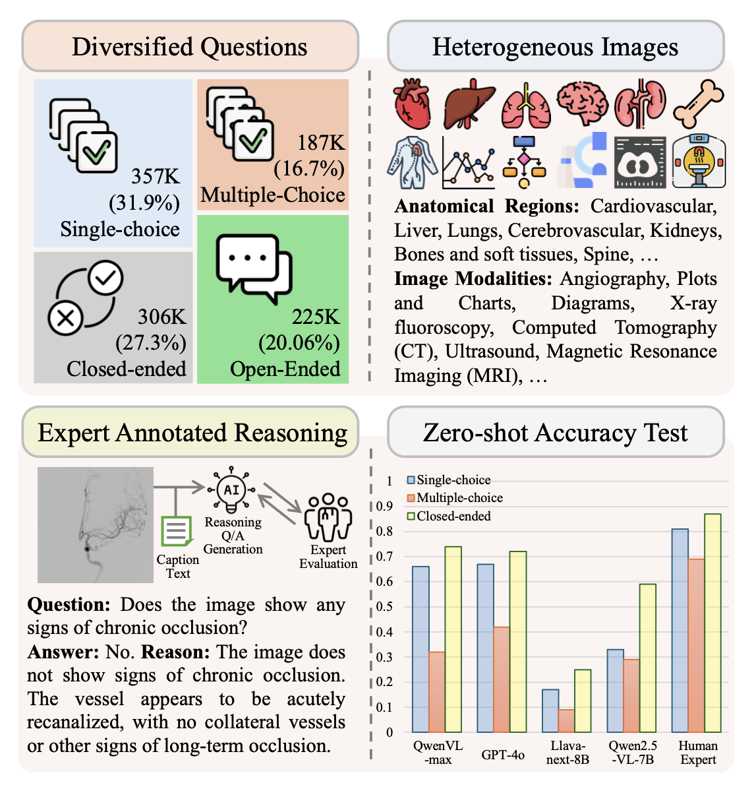

# MIRA Dataset

MIRA is a large-scale multimodal visual question answering dataset for interventional radiology. The dataset is designed to evaluate and train models on expert-level clinical reasoning over medical figures, captions, and diverse question formats.

This repository focuses on releasing the open-source dataset files derived from the MIRA benchmark described in:

**MIRA: Evaluating Multimodal AI on Complex Clinical Reasoning in Interventional Radiology**


## Download

The dataset files can be downloaded from Baidu netdisk: https://pan.baidu.com/s/1ewuwZIvNoXwLXnPhzEEcDA?pwd=m9ii

After downloading, the released dataset should contain:

```text
MIRA-data/
  train.csv
  validation.csv
  test.csv
  images/
  selection_manifest.json
```

The local release directory used to prepare this README is `MIRA-data/`. It contains 184,479 image files and is approximately 9.9 GB.

## Released Splits

| Split | Images | Questions |
|---|---:|---:|
| `train` | 178,003 | 1,120,031 |
| `validation` | 5,039 | 33,056 |
| `test` | 1,437 | 8,279 |
| **Total** | **184,479** | **1,161,366** |

## Question Types

| Split | Open-ended | Closed-ended | Single-choice | Multiple-choice | Total |
|---|---:|---:|---:|---:|---:|
| `train` | 311,970 | 318,605 | 314,269 | 175,187 | 1,120,031 |
| `validation` | 9,207 | 9,535 | 9,275 | 5,039 | 33,056 |
| `test` | 2,306 | 2,356 | 2,323 | 1,294 | 8,279 |
| **Total** | **323,483** | **330,496** | **325,867** | **181,520** | **1,161,366** |

## File Format

Each split is provided as a CSV file with three columns:

| Column | Description |
|---|---|
| `image_path` | Relative path to the copied image inside `MIRA-data/images/`. |
| `caption` | Figure caption associated with the image. |
| `vqa_json` | JSON string containing selected VQA annotations grouped by question type. |

Example `vqa_json` structure:

```json
{
  "open_ended": [
    {
      "question": "What imaging modality is used in this image?",
      "answer": {
        "text": "...",
        "visual_evidence": "..."
      }
    }
  ],
  "closed_ended": [],
  "single_choice": [],
  "multiple_choice": []
}
```

## Quick Start

```python
import json
from pathlib import Path
import pandas as pd

data_dir = Path("MIRA-data")
df = pd.read_csv(data_dir / "train.csv")
row = df.iloc[0]

image_path = data_dir / row["image_path"]
caption = row["caption"]
vqa = json.loads(row["vqa_json"])

print(image_path)
print(caption)
print(vqa.keys())
```

To iterate over all questions:

```python
QUESTION_TYPES = ["open_ended", "closed_ended", "single_choice", "multiple_choice"]

for _, row in df.iterrows():
    vqa = json.loads(row["vqa_json"])
    for question_type in QUESTION_TYPES:
        for item in vqa.get(question_type, []):
            question = item["question"]
            answer = item["answer"]
```

## Integrity Notes

The copied images in `MIRA-data/images/` were verified against the source PubMed image files by split and row order. All 184,479 copied images matched their source files byte-for-byte during local validation.

## Intended Use

MIRA is intended for research on multimodal medical AI, including:

- visual question answering in interventional radiology;
- multimodal clinical reasoning;
- model evaluation across multiple question formats;
- training and fine-tuning vision-language models for specialized medical reasoning.

The dataset is not intended for direct clinical diagnosis, treatment planning, or deployment without independent clinical validation.

The paper reports that the source image-text pairs are collected from the PubMed Central Open Access Subset under CC-BY or CC0 licensing terms. Users should comply with the original article and image licenses from PMC Open Access when redistributing or using the images.

## Citation

If you use MIRA, please cite the paper:

```bibtex
@inproceedings{li2026mira,
  title = {MIRA: Evaluating Multimodal AI on Complex Clinical Reasoning in Interventional Radiology},
  author = {Li, Jingxiong and Zhu, Chenglu and Zheng, Sunyi and Sun, Yuxuan and Wang, Yifei and Liu, He and Zhang, Yunlong and Si, Yixuan and Yang, Lin and Xiao, Liang},
  booktitle = {Proceedings of the Fortieth AAAI Conference on Artificial Intelligence},
  year = {2026}
}
```
